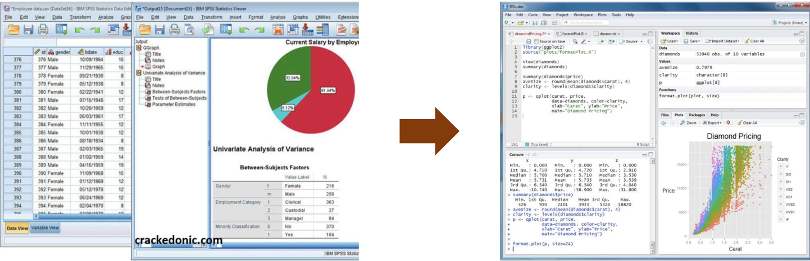

```{r set diretorio, message=FALSE, warning=FALSE, include=FALSE}
library(DT)
 setwd("~/GitHub/R_empreendedorismo1")
```

# About me! 

- Bacharel em Administração (UnB), Mestre em Administração (UFG), doutorando em Administração (UnB)
- Já desenvolveu projetos em áreas, como: empreendedorismo, gestão/políticas públicas, inovação na saúde
- Espalha a palavra do R há um ano e alguns meses
- No ócio criativo está jogando algo, assistindo vídeos de culinária ou brincando com as gatas! 

```{r gatas, figures-side, fig.show="hold", echo=FALSE, out.height="40%", out.width="30%", fig.align='center', fig.height=3, fig.cap=" "}

knitr::include_graphics("imagem/pira.jpeg")

knitr::include_graphics("imagem/gigi.jpeg")
```
---
class: inverse, middle, left
# Divisão do curso 
- Módulo 1: conceitos básicos de R 
- Módulo 2: usando o R para explorar o GEM
- Módulo 3: usando o R para explorar o PSED  

```{r gif_modulos, echo=FALSE, out.height="30%", out.width="50%",fig.align='center'}
knitr::include_graphics("https://media.giphy.com/media/3R9LDINpbGX2o/giphy.gif")
library(gapminder)
```

---
class: inverse, middle, left
# Objetivos do módulo 1
- Introduzir conceitos básicos sobre R
- Introduzir funções sobre manipulação de dados
- Introduzir funções sobre visualização de dados  

```{r gif_modulo1, echo=FALSE, out.height="30%", out.width="50%",fig.align='center'}
knitr::include_graphics("https://media.giphy.com/media/xT5LMUt1dWrBQtacJG/giphy.gif")

```
---
# Por que usar o R?

```{r why_r, echo=FALSE, out.height="80%", out.width="80%",fig.align='center'}
knitr::include_graphics("https://media.giphy.com/media/WMODmi5AX9ZEQ/giphy.gif")

```
---

# O R me dá medo 

Nunca programei... vou conseguir?

```{r r_spss, figures-side, fig.show="hold", echo=FALSE, out.height="100%", out.width="100%", fig.align='center', fig.height=3, fig.cap=" "}


```


"Não consigo entender esse bando de código..."


"É tão mais fácil usar o SPSS que basta alguns cliques e me gera resultados rapidamente..."


"Toda vez que tento usar R é erro para cá, erro para lá..." 

---
# R e ciência de dados

```{r linguagens, figures-side, fig.show="hold", echo=FALSE, out.height="70%", out.width="90%", fig.align='center', fig.height=1, fig.cap=" "}


```

fonte: [Towards data science](https://towardsdatascience.com/training-your-staff-in-data-science-heres-how-to-pick-the-right-programming-language-dda349354b18)

---

# Data Literacy

```{r literacy, figures-side, fig.show="hold", echo=FALSE, out.height="70%", out.width="70%", fig.align='center', fig.height=3, fig.cap=" "}


```

fonte: [Medium](https://medium.com/somos-tera/data-literacy-o-que-%C3%A9-a-alfabetiza%C3%A7%C3%A3o-de-dados-e-porque-ela-%C3%A9-t%C3%A3o-importante-para-sua-empresa-951fcc5bcc67)

---

# Literatura científica 

```{r artigos, figures-side, fig.show="hold", echo=FALSE, out.height="100%", out.width="100%", fig.align='center', fig.height=3, fig.cap=" "}

knitr::include_graphics("imagem/analytics-capabilities.png")
```

---

# Na área de empreendedorismo

```{r sbe, figures-side, fig.show="hold", echo=FALSE, out.height="80%", out.width="80%", fig.align='center', fig.height=3, fig.cap=" "}

knitr::include_graphics("imagem/sbe.png")
```
---
class: inverse, middle, center

# Conceitos básicos de R

---
# O R é um calculadora 

```{r operacoes_basicas}
# Operações básicas
5 + 5
10 - 6
10*2
5/2
5**2
```
---

# Operações de atribuição 

```{r atribuicoes}
sqrt(16)
5*(50-45)

#Atribuições
x <- 5 + 5
y <- 10 - 16
a <- 9
soma <- a + x
nome <- "daniel"
certo <- TRUE
```
---

# Operações básicas

```{r operacoes} 
pesoDaniel <- 79
alturaDaniel <- 1.78
imcDaniel <- pesoDaniel/alturaDaniel**2
```

Calcule o IMC de todas as pessoas
```{r imc, figures-side, fig.show="hold", echo=FALSE, out.height="90%", out.width="90%", fig.align='center', fig.height=3, fig.cap=" "}

knitr::include_graphics("imagem/imc.png")
```

---
# Vetores 

Você até pode fazer o IMC de cada um individualmente. 

Mas vou apresentar uma forma de resolver - existem várias formas, usando função, loops - usando um tipo de objeto chamado **vetor**. O vetor é um conjunto unidimensional de objetos de um mesmo tipo. 

Traduzindo... imagina uma tabela de excel formada por várias colunas. Uma das colunas é a idade e está expressa em número. Pronto, um vetor é como se fosse uma coluna com valores de um mesmo tipo.

```{r vetores}
# trabalhando com vetores
pesos <- c(65, 95, 75, 77, 80, 68)
alturas <- c(1.60, 1.78, 1.80, 1.68, 1.72, 1.65)
imc <- pesos/alturas**2
imc
```
---

# Daniel, consigo arredondar?

Consegue! 

```{r round, message=FALSE, warning=FALSE}

help(round)
round(imc, 2)
imc <- round(imc, 2) #estou sobrescrevendo um vetor
                     # arredondado sobre ele mesmo
imc

```
---

# Matrizes 
As **matrizes** possui uma estrutura tabular, com linhas e colunas. Porém, semelhante ao vetor, todos os objetos devem ser de um mesmo tipo (ex.: tudo número, tudo caracter). 

```{r matriz}
Matriz<-cbind(pesos,alturas,imc)
Matriz
```

---
# Matriz
Veja que tem uma carinha de tabela. Mas daqui para frente vamos trabalhar com outra estrutura chamada **dataframe**. Essa estrutura tem formato tabular e ainda permite que os objetos tenham tipos diferentes, ou seja, posso ter uma coluna numérica, outra no formato data, outra no formato de caracteres e assim por diante. 

Existe um tipo de dados chamado **lista** muito importante também. Mas entrar nele é assunto para um curso de R intermediário.  

```{r matriz2}
rownames(Matriz)<-c("Alice","Gilmar","Cecilia","Bianca","Valentina","Augusto")
Matriz
```

---
class: inverse, middle, center

# Introduzindo funções para manipulação de dados

---
class: inverse, middle, center

# Introduzindo funções para visualização de dados

---
# Dica de leitura 

```{r livro, figures-side, fig.show="hold", echo=FALSE, out.height="50%", out.width="50%", fig.align='center', fig.height=3, fig.cap=" "}


```

---

# Preparando nosso ambiente

Antes de começar, vamos chamar alguns pacotes e preparar uma base que usaremos! Caso não tenha algum dos pacotes abaixo ainda, terá que baixar usando o comando **install.packages("nome do pacote")**.

```{r inicializar, echo=TRUE, message=FALSE, warning=FALSE}
library(ggplot2)
library(dplyr)
library(gapminder)

base <- gapminder %>% 
  filter(year == 2007) 

glimpse(base)
```

---

# Curiosidade! ;)

**FYI:** Gapminder é uma organização sem fins lucrativos que promove o desenvolvimento e atingimento dos ODS ao difundir a compreensão de informações de ordem social, econômica, ambiental a nível local, nacional e global. 

```{r ods, echo=FALSE, fig.align='center'}
knitr::include_graphics("imagem/ODS.png")

```

---

# GGPlot2 - a base de tudo
O R por si só possui funções para gerar gráficos, porém o ggplot2 é um pacote que fornece um conjunto bem extenso de possibilidades 

```{r histograma1, echo=TRUE, message=FALSE, warning=FALSE,fig.align='center', fig.height=6, fig.width=6}

hist(base$lifeExp)

```

---

# GGPlot2 - a base de tudo
Vamos criar um histograma sobre a variável expectativa de vida. 

```{r histograma2, echo=TRUE, message=FALSE, warning=FALSE,fig.align='center', fig.height=6, fig.width=6}

ggplot(base, aes(x = lifeExp)) + geom_histogram()

```
---

# GGPlot2 - Densidade
Vamos criar um gráfico de densidade sobre a variável expectativa de vida. Veja outra forma de usar a função ggplot. 

```{r densidade, echo=TRUE, message=FALSE, warning=FALSE,fig.align='center', fig.height=6, fig.width=6}

base %>% 
  ggplot(aes(x = lifeExp)) + geom_density()

```
---

# GGPlot2 - Boxplot

Vamos criar um boxplot sobre a variável expectativa de vida. 

```{r boxplot1, echo=TRUE, message=FALSE, warning=FALSE,fig.align='center', fig.height=6, fig.width=6}

base %>% 
  ggplot(aes(y = lifeExp)) + geom_boxplot()

```

---

# GGPlot2 - Boxplot 2

Vamos criar um boxplot sobre a variável expectativa de vida. 

```{r boxplot2, echo=TRUE, message=FALSE, warning=FALSE,fig.align='center', fig.height=6, fig.width=6}

base %>% 
  ggplot(aes(x = continent, y = lifeExp)) + geom_boxplot()

```
---

# GGPlot2 - Gráfico de colunas 

Vamos criar um gráfico de barras da variável expectativa de vida. Nesse caso, vamos pegar os 10 países da Ásia com maior taxa de expectativa de vida. 

```{r barras, echo=TRUE, message=FALSE, warning=FALSE,fig.align='center', fig.height=5, fig.width=4}

base %>% 
  filter(continent == "Asia") %>% 
  top_n(n = 10, wt = lifeExp) %>% 
  ggplot(aes(x = country, y = lifeExp)) + geom_col() 

```

---

# GGPlot2 - Coord_flip

Veja como melhorar a visualização com um simples argumento 

```{r barras2, echo=TRUE, message=FALSE, warning=FALSE,fig.align='center', fig.height=5, fig.width=4}

base %>% 
  filter(continent == "Asia") %>% 
  top_n(n = 10, wt = lifeExp) %>% 
  ggplot(aes(x = country, y = lifeExp)) + geom_col() + coord_flip()

```

---

#Mas, Daniel, consigo deixar em ordem?
Sim, para isso, vamos usar uma função do pacote forcats.

```{r barras3, echo=TRUE, message=FALSE, warning=FALSE,fig.align='center', fig.height=4, fig.width=6}
library(forcats)
base %>% 
  filter(continent == "Asia") %>% 
  top_n(n = 10, wt = lifeExp) %>% 
  ggplot(aes(x = fct_reorder(country,lifeExp), y = lifeExp)) + geom_col() + coord_flip()

```
---

# GGPlot2 - Labels

Adicionando labels 

```{r barras4, echo=TRUE, message=FALSE, warning=FALSE,fig.align='center', fig.height=5, fig.width=4}

base %>% 
  filter(continent == "Asia") %>% 
  top_n(n = 10, wt = lifeExp) %>% 
  ggplot(aes(x = fct_reorder(country,lifeExp), y = lifeExp)) + geom_col() + 
  geom_label(aes(label=round(lifeExp))) +  coord_flip()

```
---

# GGPlot2 - Linhas

Para fazer esse gráfico, vamos usar a base original, gapminder, e filtrar apenas o Brasil. 

```{r linhas, echo=TRUE, message=FALSE, warning=FALSE,fig.align='center', fig.height=5, fig.width=6}

gapminder %>% 
  filter(country == "Brazil") %>% 
  ggplot(aes(x = year, y = lifeExp)) + geom_line() 

```
---

# GGPlot2 - Argumento col

Veja que legal é o argumento col dentro do aes.

```{r linhas2, echo=TRUE, message=FALSE, warning=FALSE,fig.align='center', fig.height=5, fig.width=6}
paises <- c("Brazil","Argentina")

gapminder %>% 
  filter(country == paises) %>% 
  ggplot(aes(x = year, y = lifeExp, col = country)) + geom_line() 

```
---

# Usando argumento fill 

Vamos ver como funciona o argumento `fill`

```{r densidade_customizada2, echo=TRUE, fig.align='center', fig.height=5.5, fig.width=6.5, message=FALSE, warning=FALSE}

base %>% 
  top_n(10) %>% 
  ggplot(aes(x = fct_reorder(country,gdpPercap), y=gdpPercap, fill = continent)) + geom_col() + coord_flip()

```
---

# Massa, Daniel! 
Você falou que podíamos customizar muita coisa. E aí? Calma, jovem, veja só...  

```{r densidade customizada, echo=TRUE, fig.align='center', fig.height=5.5, fig.width=5.5, message=FALSE, warning=FALSE}

ggplot(base,aes(x=lifeExp)) + geom_density(fill="darkblue") +
labs(title = "Histograma da expectativa de vida", 
     x = "Expectativa de vida", y = "Frequência") + theme_minimal()
```
---

# Vamos trabalhar com duas variáveis... 

Vamos relacionar duas variáveis: PIB per capita e expectativa de vida 

```{r scatter, echo=TRUE, fig.align='center', fig.height=5.5, fig.width=6.5, message=FALSE, warning=FALSE}

ggplot(base,aes(x=log(gdpPercap),y=lifeExp)) + geom_point() +
labs(x = "PIB per capita (log)", y = "Expectativa de vida") + theme_bw()
```
---

# Mais uma camada...

```{r scatter2, echo=TRUE, fig.align='center', fig.height=5.5, fig.width=5.5, message=FALSE, warning=FALSE}

ggplot(base,aes(y=lifeExp, x=log(gdpPercap))) + geom_point() +
  geom_smooth(method = "lm", se=FALSE) + 
  labs(x = "PIB per capita (log)",
       y = "Expectativa de vida") + theme_bw()
```
---

# Argumento col 

```{r scatter3, echo=TRUE, fig.align='center', fig.height=5.5, fig.width=5.5, message=FALSE, warning=FALSE}

ggplot(base,aes(y=lifeExp, x=log(gdpPercap), col=continent)) + geom_point() +
  geom_smooth(method = "lm", se=FALSE) + 
  labs(x = "PIB per capita (log)",
       y = "Expectativa de vida") + theme_bw()
```
---

# Argumento size

```{r scatter4, echo=TRUE, fig.align='center', fig.height=5.5, fig.width=5.5, message=FALSE, warning=FALSE}

ggplot(base,aes(y=lifeExp, x=log(gdpPercap), col=continent,size = pop)) + geom_point() +
  geom_smooth(method = "lm", se=FALSE) + 
  labs(x = "PIB per capta (log)",
       y = "Expectativa de vida") + theme_bw()
```
---

# Facet 

```{r scatter5, echo=TRUE, fig.align='center', fig.height=5.5, fig.width=8, message=FALSE, warning=FALSE}

ggplot(base,aes(x=log(gdpPercap), y=lifeExp, col=continent,
size = pop)) + geom_point() + geom_smooth(method = "lm", se=FALSE) + 
  labs(x = "PIB per capita (log)", y = "Expectativa de vida") + theme_bw() + 
  facet_grid(~continent)
```
---

# Tabela interativa (Bônus!)
Conhecimentos nerds extras. Clique [aqui](https://rstudio.github.io/DT/) para conhecer mais do pacote DT. 

```{r datatable, fig.height=5, fig.width=5}
DT::datatable(base, options = list(pageLength = 5), class = 'cell-border stripe')
```
---

# Tarefa de casa

1) Crie um boxplot para a variável expectativa de vida

2) Crie um boxplot para a variável expectativa de vida e cada  continentes em um mesmo painel

3) Faça o mesmo que a questão 2, mas dessa vez use facet

4) Insira título nos gráficos, mude o nome dos eixos e coloque outro tema

5) Faça um gráfico de linha com a evolução do PIB per capta do Brasil, Argentina, Portugal e China
```{r gif_data2, echo=FALSE, out.height="10%", out.width="20%",fig.align='center'}
knitr::include_graphics("https://media.giphy.com/media/ptPx1nVWOG32E/giphy.gif")
```

---

# Criando gráficos com Esquisse 

esquisser(viewer = "browser")


```{r imagem_esquisse, figures-side, fig.show="hold", echo=FALSE, out.height="70%", out.width="90%", fig.align='center', fig.height=3, fig.cap=" "}

knitr::include_graphics("imagem/esquisse.png")

```

---

# Gerando gráficos interativos 

Vamos resgatar um gráfico que fizemos lá atrás 

```{r plotly2, echo=TRUE, message=FALSE, fig.height=4, fig.width=5.5, warning=FALSE, fig.align='center'}
library(plotly)

grafico <- ggplot(base,aes(y=lifeExp, x=log(gdpPercap), col=continent)) + geom_point() +
  labs(x = "PIB per capita (log)",
       y = "Expectativa de vida") + theme_bw()

ggplotly(grafico)

```
---

# Para aprender mais

- [GGPlot2 cheat sheet](https://rstudio.com/wp-content/uploads/2015/03/ggplot2-cheatsheet.pdf)
- [GGPlot2 - LAPEI](https://www.youtube.com/watch?v=IPyjHKe30eo)
- [Plotly](https://plotly.com/)
- [Blog Datanovia](https://www.datanovia.com/en/blog/gganimate-how-to-create-plots-with-beautiful-animation-in-r/)
- [Datavis with R](https://rkabacoff.github.io/datavis/Interactive.html)
Apresentação feita com Rmarkdown, usando pacote xaringã

```{r gif_aprofundar, echo=FALSE, fig.align='center', warning=FALSE, out.height="40%", out.width="70%"}
knitr::include_graphics("https://media.giphy.com/media/13HBDT4QSTpveU/giphy.gif")
```

---
class: inverse, middle, center

# Obrigado

**Daniel Pagotto** | danielppagotto@gmail.com | [LinkedIn](https://www.linkedin.com/in/daniel-do-prado-pagotto-bab62a50/)


