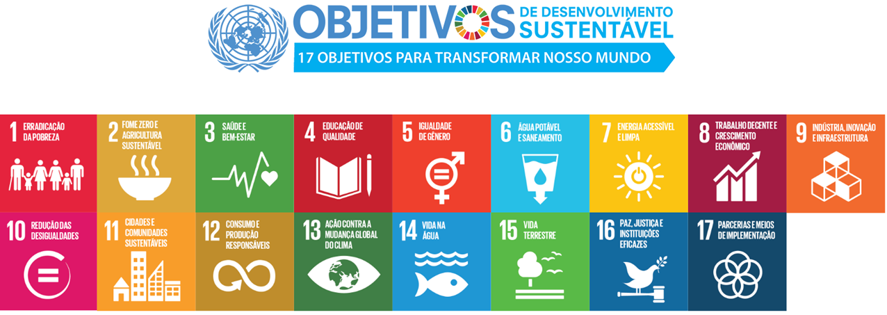

```{r set diretorio, message=FALSE, warning=FALSE, include=FALSE}
library(DT)
 setwd("~/GitHub/R_empreendedorismo1")
```

# About me! 

- Bacharel em Administração (UnB), Mestre em Administração (UFG), doutorando em Administração (UnB)
- Já desenvolveu projetos em áreas, como: empreendedorismo, gestão/políticas públicas, inovação na saúde
- Espalha a palavra do R há um ano e alguns meses
- No ócio criativo está jogando algo, assistindo vídeos de culinária ou brincando com as gatas! 

```{r gatas, figures-side, fig.show="hold", echo=FALSE, out.height="40%", out.width="30%", fig.align='center', fig.height=3, fig.cap=" "}

knitr::include_graphics("imagem/pira.jpeg")

knitr::include_graphics("imagem/gigi.jpeg")
```
---
class: inverse, middle, left
# Objetivos da aula 1
- Introduzir conceitos básicos sobre 
- Introduzir funções sobre manipulação de dados
- Introduzir funções sobre visualização de dados  

```{r gif_data, echo=FALSE, out.height="30%", out.width="50%",fig.align='center'}
knitr::include_graphics("https://media.giphy.com/media/xT5LMUt1dWrBQtacJG/giphy.gif")
library(gapminder)
```
---
class: inverse, middle, center

# Introduzindo funções para visualização de dados

---
# Dica de leitura 

```{r livro, figures-side, fig.show="hold", echo=FALSE, out.height="40%", out.width="30%", fig.align='center', fig.height=3, fig.cap=" "}

knitr::include_graphics("imagem/storytelling.jpg")

```

---

# Preparando nosso ambiente

Antes de começar, vamos chamar alguns pacotes e preparar uma base que usaremos! Caso não tenha algum dos pacotes abaixo ainda, terá que baixar usando o comando **install.packages("nome do pacote")**.

```{r inicializar, echo=TRUE, message=FALSE, warning=FALSE}
library(ggplot2)
library(dplyr)
library(gapminder)

base <- gapminder %>% 
  filter(year == 2007) 

glimpse(base)

```

---
# Curiosidade! ;)

**FYI:** Gapminder é uma organização sem fins lucrativos que promove o desenvolvimento e atingimento dos ODS ao difundir a compreensão de informações de ordem social, econômica, ambiental a nível local, nacional e global. 

```{r ods, echo=FALSE, fig.align='center'}


```

---
# GGPlot2 - a base de tudo
O R por si só possui funções para gerar gráficos, porém o ggplot2 é um pacote que fornece um conjunto bem extenso de possibilidades 

```{r histograma1, echo=TRUE, message=FALSE, warning=FALSE,fig.align='center', fig.height=6, fig.width=6}

hist(base$lifeExp)

```

---
# GGPlot2 - a base de tudo
Vamos criar um histograma sobre a variável expectativa de vida. 

```{r histograma2, echo=TRUE, message=FALSE, warning=FALSE,fig.align='center', fig.height=6, fig.width=6}

ggplot(base, aes(x = lifeExp)) + geom_histogram()

```
---
# GGPlot2 - a base de tudo
Vamos criar um gráfico de densidade sobre a variável expectativa de vida. Veja outra forma de usar a função ggplot. 

```{r densidade, echo=TRUE, message=FALSE, warning=FALSE,fig.align='center', fig.height=6, fig.width=6}

base %>% 
  ggplot(aes(x = lifeExp)) + geom_density()

```
---

# GGPlot2 - a base de tudo
Vamos criar um boxplot sobre a variável expectativa de vida. 

```{r boxplot1, echo=TRUE, message=FALSE, warning=FALSE,fig.align='center', fig.height=6, fig.width=6}

base %>% 
  ggplot(aes(y = lifeExp)) + geom_boxplot()

```

---

# GGPlot2 - a base de tudo
Vamos criar um boxplot sobre a variável expectativa de vida. 

```{r boxplot2, echo=TRUE, message=FALSE, warning=FALSE,fig.align='center', fig.height=6, fig.width=6}

base %>% 
  ggplot(aes(x = continent, y = lifeExp)) + geom_boxplot()

```

---
# Massa, Daniel! 
E o que mais dá para customizar? 

```{r densidade customizada, echo=TRUE, fig.align='center', fig.height=5.5, fig.width=5.5, message=FALSE, warning=FALSE}

ggplot(base,aes(x=lifeExp)) + geom_histogram(fill="darkblue") +
labs(title = "Histograma da expectativa de vida", 
     x = "Expectativa de vida", y = "Frequência") + theme_bw()
```

---
# PIB per capta e expectativa de vida 
Vamos trabalhar com duas variáveis agora... 
```{r scatter, echo=TRUE, fig.align='center', fig.height=5.5, fig.width=5.5, message=FALSE, warning=FALSE}

ggplot(base,aes(x=log(gdpPercap),y=lifeExp)) + geom_point() +
labs(x = "PIB per capita (log)", y = "Expectativa de vida") + theme_bw()
```

---
# Mais uma camada...

```{r scatter2, echo=TRUE, fig.align='center', fig.height=5.5, fig.width=5.5, message=FALSE, warning=FALSE}

ggplot(base,aes(y=lifeExp, x=log(gdpPercap))) + geom_point() +
  geom_smooth(method = "lm", se=FALSE) + 
  labs(x = "PIB per capita (log)",
       y = "Expectativa de vida") + theme_bw()
```

---
# Argumento col 

```{r scatter3, echo=TRUE, fig.align='center', fig.height=5.5, fig.width=5.5, message=FALSE, warning=FALSE}

ggplot(base,aes(y=lifeExp, x=log(gdpPercap), col=continent)) + geom_point() +
  geom_smooth(method = "lm", se=FALSE) + 
  labs(x = "PIB per capita (log)",
       y = "Expectativa de vida") + theme_bw()
```

---
# Argumento size

```{r scatter4, echo=TRUE, fig.align='center', fig.height=5.5, fig.width=5.5, message=FALSE, warning=FALSE}

ggplot(base,aes(y=lifeExp, x=log(gdpPercap), col=continent,size = pop)) + geom_point() +
  geom_smooth(method = "lm", se=FALSE) + 
  labs(x = "PIB per capta (log)",
       y = "Expectativa de vida") + theme_bw()
```

---
# Facet 

```{r scatter5, echo=TRUE, fig.align='center', fig.height=5.5, fig.width=8, message=FALSE, warning=FALSE}

ggplot(base,aes(x=log(gdpPercap), y=lifeExp, col=continent,
size = pop)) + geom_point() + geom_smooth(method = "lm", se=FALSE) + 
  labs(x = "PIB per capita (log)", y = "Expectativa de vida") + theme_bw() + 
  facet_grid(~continent)
```
---
# Tabela interativa (Bônus!)
Conhecimentos nerds extras. Clique [aqui](https://rstudio.github.io/DT/) para conhecer mais do pacote DT. 

```{r datatable, fig.height=5, fig.width=5}
DT::datatable(base, options = list(pageLength = 5), class = 'cell-border stripe')
```
---
# Tarefa de casa

1) Crie um boxplot para a variável expectativa de vida

2) Crie um boxplot para a variável expectativa de vida e cada  continentes em um mesmo painel

3) Faça o mesmo que a questão 2, mas dessa vez use facet

4) Insira título nos gráficos, mude o nome dos eixos e coloque outro tema


```{r gif_data2, echo=FALSE, out.height="10%", out.width="20%",fig.align='center'}
knitr::include_graphics("https://media.giphy.com/media/ptPx1nVWOG32E/giphy.gif")
```

---
class: inverse, middle, center

# Criando gráficos com o Esquisse

---

# Esquisse 

esquisser(viewer = "browser")


```{r imagem_esquisse, figures-side, fig.show="hold", echo=FALSE, out.height="70%", out.width="90%", fig.align='center', fig.height=3, fig.cap=" "}

knitr::include_graphics("imagem/esquisse.png")

```

---
class: inverse, middle, center

# Plotly

---
# Gerando gráficos interativos 

Vamos resgatar um gráfico que fizemos lá atrás 

```{r plotly2, echo=TRUE, message=FALSE, fig.height=4, fig.width=5.5, warning=FALSE, fig.align='center'}
library(plotly)

grafico <- ggplot(base,aes(y=lifeExp, x=log(gdpPercap), col=continent)) + geom_point() +
  labs(x = "PIB per capita (log)",
       y = "Expectativa de vida") + theme_bw()

ggplotly(grafico)

```

---

# Para aprender mais

- [GGPlot2 cheat sheet](https://rstudio.com/wp-content/uploads/2015/03/ggplot2-cheatsheet.pdf)
- [GGPlot2 - LAPEI](https://www.youtube.com/watch?v=IPyjHKe30eo)
- [Plotly](https://plotly.com/)
- [Blog Datanovia](https://www.datanovia.com/en/blog/gganimate-how-to-create-plots-with-beautiful-animation-in-r/)

Apresentação feita com Rmarkdown, usando pacote xaringã

```{r gif_aprofundar, echo=FALSE, fig.align='center', warning=FALSE, out.height="40%", out.width="70%"}
knitr::include_graphics("https://media.giphy.com/media/13HBDT4QSTpveU/giphy.gif")
```

---
class: inverse, middle, center

# Obrigado

**Daniel Pagotto** | danielppagotto@gmail.com | [LinkedIn](https://www.linkedin.com/in/daniel-do-prado-pagotto-bab62a50/)


